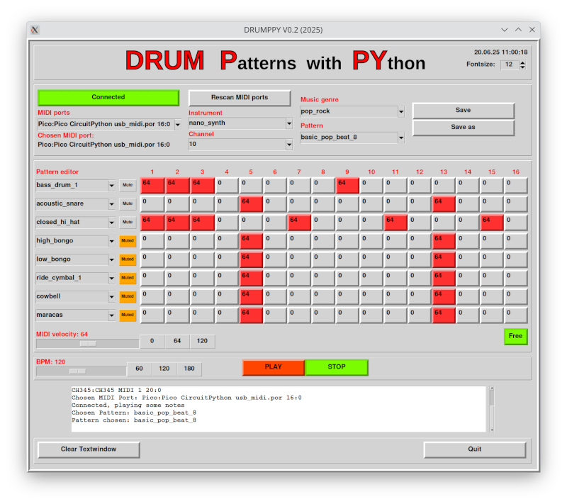

# DRUMPPY: A simple drum pattern editor and player with Python

## Some infos

I wanted to better understand how drum machines work. Hydrogen is a good and powerfull software for Linux and I will use it perhaps later.

I found the cool Mido library for Python, and played a little. So here is DRUMPPY a simple drum pattern editor :)

The software is alpha!
